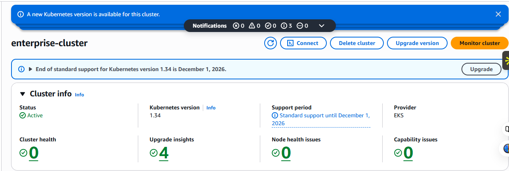
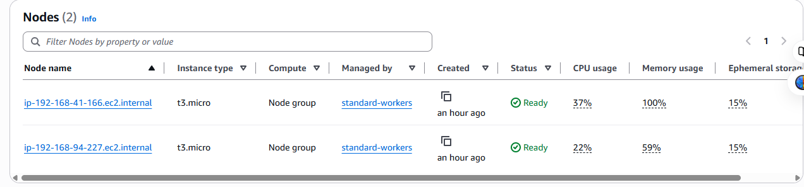
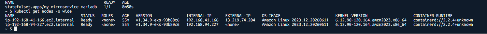
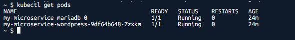
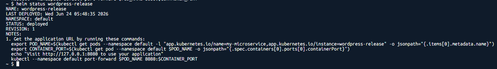
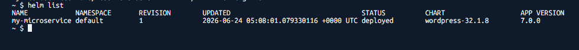
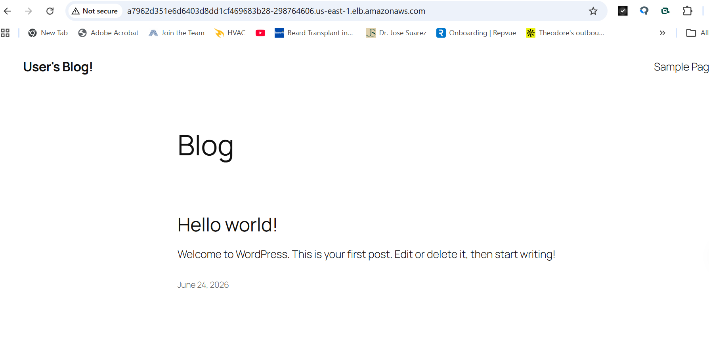
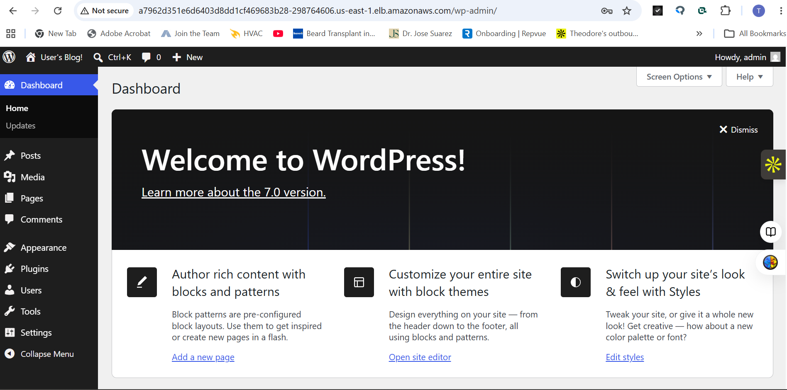

# AWS Enterprise EKS WordPress Platform

## Project Overview

This project demonstrates the deployment of a production-style WordPress platform on Amazon Elastic Kubernetes Service (EKS) using Kubernetes, Helm, AWS IAM, managed node groups, and AWS networking services.

The objective was to simulate how a cloud engineering team would deploy and manage a containerized application in a Kubernetes environment while leveraging AWS-managed infrastructure. Rather than deploying WordPress directly to a virtual machine, the application was deployed using Kubernetes workloads and managed through Helm, providing a scalable, repeatable, and enterprise-focused deployment model.

This project provided hands-on experience with:

- Amazon EKS cluster administration
- Kubernetes workload deployment
- Helm package management
- AWS IAM and security configuration
- Managed node groups
- VPC networking
- Kubernetes troubleshooting
- Cloud-native application deployment
- Infrastructure validation and monitoring

---

# Business Scenario

A company wants to modernize its web application infrastructure by moving away from traditional single-server deployments and adopting a cloud-native architecture.

The solution must:

- Support containerized applications
- Allow workload scaling
- Simplify deployments
- Improve operational efficiency
- Reduce infrastructure management overhead
- Follow modern DevOps and Kubernetes practices

Amazon EKS was selected as the orchestration platform because it provides a fully managed Kubernetes control plane while allowing organizations to focus on application deployment rather than infrastructure maintenance.

---

# Architecture

## High-Level Architecture

```text
Internet Users
       │
       ▼
AWS Load Balancer
       │
       ▼
Amazon EKS Cluster
       │
 ┌─────┴─────┐
 │           │
 ▼           ▼
Worker Node  Worker Node
(t3.micro)   (t3.micro)
       │
       ▼
WordPress Pods
       │
       ▼
Kubernetes Services
       │
       ▼
Application Access
```

---

# Technologies Used

| Technology | Purpose |
|------------|----------|
| Amazon EKS | Managed Kubernetes Platform |
| Kubernetes | Container Orchestration |
| Helm | Kubernetes Package Management |
| Amazon EC2 | Worker Nodes |
| AWS IAM | Identity and Access Management |
| AWS VPC | Network Isolation |
| Security Groups | Firewall Controls |
| kubectl | Kubernetes Administration |
| AWS CloudShell | Command Line Management |
| WordPress | Containerized Application |
| GitHub | Version Control & Documentation |

---

# Infrastructure Components

## Amazon EKS Cluster

### Cluster Information

| Setting | Value |
|----------|--------|
| Cluster Name | enterprise-cluster |
| Region | us-east-1 |
| Kubernetes Version | 1.34 |
| Endpoint Access | Public |
| Control Plane | AWS Managed |

### Purpose

The EKS control plane is responsible for:

- Scheduling workloads
- Managing cluster state
- Handling API requests
- Monitoring worker nodes
- Maintaining Kubernetes services

---

## Managed Node Group

### Node Group Configuration

| Setting | Value |
|----------|--------|
| Node Group Name | standard-workers |
| Instance Type | t3.micro |
| Desired Capacity | 2 |
| Minimum Nodes | 2 |
| Maximum Nodes | 3 |
| AMI Type | Amazon Linux 2023 |

### Purpose

The node group provides:

- Compute resources
- Pod execution
- Application hosting
- Kubernetes workload processing

---

## IAM Configuration

### EKS Cluster Role

Allows Amazon EKS to:

- Manage Kubernetes control plane resources
- Provision AWS services
- Integrate with networking components

### Worker Node Role

Role Name:

```text
EKSNodeInstanceRole
```

Policies Attached:

- AmazonEKSWorkerNodePolicy
- AmazonEKS_CNI_Policy
- AmazonEC2ContainerRegistryReadOnly

### Purpose

Allows worker nodes to:

- Join the EKS cluster
- Pull container images
- Communicate with EKS APIs
- Manage Kubernetes networking

---

# Helm Deployment

Helm was used to package and deploy Kubernetes resources.

## Why Helm?

Helm simplifies Kubernetes management by:

- Packaging applications
- Managing releases
- Simplifying updates
- Supporting rollbacks
- Reducing YAML complexity

### Helm Installation

```bash
helm version
```

### Create Helm Chart

```bash
helm create my-microservice
```

### Deploy Application

```bash
helm install wordpress-release ./my-microservice
```

---

# Kubernetes Validation

## Verify Worker Nodes

```bash
kubectl get nodes
```

Expected Result:

```text
STATUS: Ready
```

This confirms:

- Worker nodes joined the cluster
- Kubernetes can schedule workloads
- Infrastructure is operational

---

## Verify Pods

```bash
kubectl get pods
```

This confirms:

- Application workloads are deployed
- Containers are running successfully
- Kubernetes scheduling is functioning properly

---

## Verify Helm Release

```bash
helm list
```

This confirms:

- Helm deployment completed successfully
- Application is registered within Kubernetes
- Release management is operational

---

# WordPress Deployment

WordPress was deployed as a Kubernetes-managed application.

Benefits include:

- High portability
- Simplified upgrades
- Scalable architecture
- Infrastructure abstraction
- Enterprise deployment model

The application was successfully deployed and validated through both the public homepage and WordPress administrative dashboard.

---

# Deployment Challenges & Troubleshooting

## Challenge #1: Node Group Provisioning Failure

### Problem

Initial node group deployment failed because:

```text
t3.medium is not eligible for Free Tier
```

### Root Cause

AWS account restrictions prevented the launch of non-Free Tier eligible instances.

### Resolution

Recreated the node group using:

```text
t3.micro
```

### Outcome

Worker nodes successfully joined the cluster.

---

## Challenge #2: CloudFormation Stack Conflicts

### Problem

During cluster recreation attempts, orphaned resources prevented successful deployments.

### Resolution

- Investigated CloudFormation events
- Identified failed resources
- Removed dependencies
- Cleaned infrastructure
- Rebuilt the environment

### Outcome

Successful cluster deployment.

---

## Challenge #3: IAM Permissions

### Problem

Worker nodes could not launch without a properly configured IAM role.

### Resolution

Created:

```text
EKSNodeInstanceRole
```

Attached required policies and validated permissions.

### Outcome

Worker nodes successfully registered with the EKS cluster.

---

# Screenshots & Deployment Evidence

## Screenshot 1 – EKS Cluster Dashboard



This screenshot verifies successful creation of the Amazon EKS control plane and confirms that the Kubernetes cluster was provisioned successfully.

---

## Screenshot 2 – Managed Node Group



This screenshot demonstrates successful deployment of the managed worker node group that provides compute resources for Kubernetes workloads.

---

## Screenshot 3 – kubectl get nodes



This validation confirms that worker nodes successfully joined the Kubernetes cluster and reached a Ready state.

---

## Screenshot 4 – kubectl get pods



This screenshot validates successful Kubernetes workload scheduling and confirms that application containers are operational.

---

## Screenshot 5 – Helm Deployment



This screenshot verifies successful deployment of the application using Helm and confirms release creation within the Kubernetes cluster.

---

## Screenshot 6 – Helm Release List



This screenshot demonstrates successful Helm package management and confirms the deployed application release.

---

## Screenshot 7 – WordPress Homepage



This screenshot validates successful external application access through Kubernetes networking and AWS load balancing services.

---

## Screenshot 8 – WordPress Admin Dashboard



This screenshot demonstrates complete application functionality and confirms successful deployment of the WordPress administrative interface.

---

# Resource Inventory

## Compute Resources

| Resource | Quantity |
|-----------|-----------|
| EKS Cluster | 1 |
| Managed Node Group | 1 |
| Worker Nodes | 2 |
| WordPress Deployment | 1 |
| Kubernetes Services | Multiple |

---

## Networking Resources

| Resource | Quantity |
|-----------|-----------|
| VPC | 1 |
| Security Groups | Multiple |
| Public Subnets | 2 |
| Private Subnets | 2 |
| Route Tables | Multiple |
| Load Balancer Services | 1 |

---

## IAM Resources

| Resource | Quantity |
|-----------|-----------|
| Cluster Role | 1 |
| Node Instance Role | 1 |
| IAM Policies | 3 |

---

# Cost Analysis

> Cost estimates are approximate and may vary by AWS region and usage.

## Amazon EKS Control Plane

| Resource | Estimated Cost |
|-----------|-----------|
| EKS Control Plane | ~$72/month |

Amazon EKS charges approximately:

```text
$0.10 per hour
```

---

## EC2 Worker Nodes

| Resource | Estimated Cost |
|-----------|-----------|
| 2 x t3.micro | Free Tier Eligible |

Outside the Free Tier:

```text
Approximately $8–10 per node per month
```

---

## Load Balancer

| Resource | Estimated Cost |
|-----------|-----------|
| AWS Load Balancer | ~$16–25/month |

Depends on:

- Traffic volume
- Requests
- Data transfer

---

## VPC Components

Resources include:

- VPC
- Route Tables
- Security Groups
- Subnets

Estimated Cost:

```text
No direct charge
```

---

## Estimated Monthly Cost

### Lab Environment

| Resource | Estimated Monthly Cost |
|-----------|-----------|
| EKS Control Plane | ~$72 |
| Worker Nodes | Free Tier |
| Load Balancer | ~$16–25 |
| Networking | Minimal |
| Total | ~$88–100/month |

---

# Skills Demonstrated

## Cloud Engineering

- Amazon EKS
- Amazon EC2
- AWS IAM
- AWS Networking
- Security Groups
- VPC Design

## Kubernetes

- Cluster Administration
- Node Management
- Pod Management
- Service Configuration
- Workload Deployment

## DevOps

- Helm
- Infrastructure Troubleshooting
- Deployment Validation
- CloudShell Operations

## Source Control

- GitHub Repository Management
- Documentation
- Project Portfolio Development

---

# Key Takeaways

This project demonstrates the deployment of a production-style application using Kubernetes and Amazon EKS while incorporating cloud engineering, DevOps, and infrastructure management practices. Through the implementation of managed node groups, IAM security controls, Helm deployments, Kubernetes administration, and AWS networking, this project showcases hands-on experience with cloud-native application deployment and enterprise Kubernetes operations.

The successful deployment and validation of WordPress confirms end-to-end functionality across the entire platform and serves as a strong demonstration of practical AWS and Kubernetes engineering skills.
